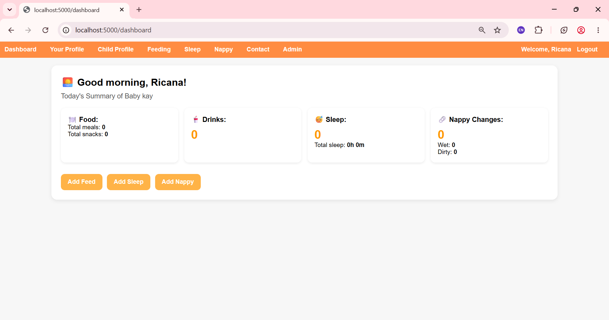
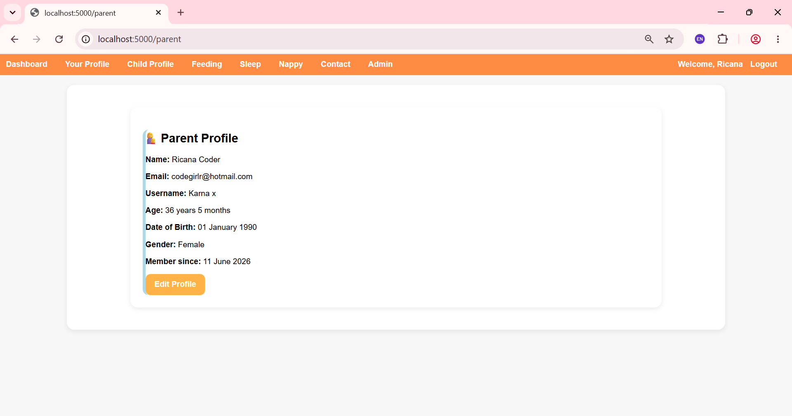
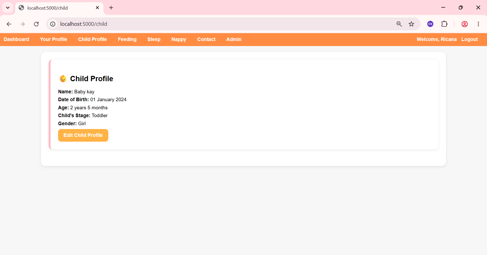
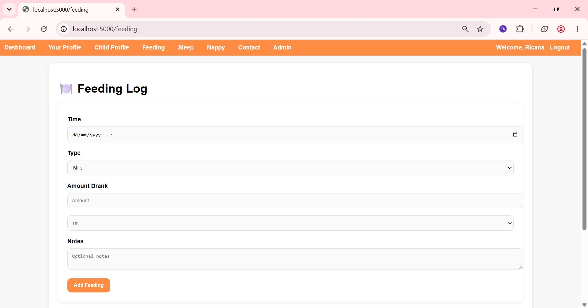
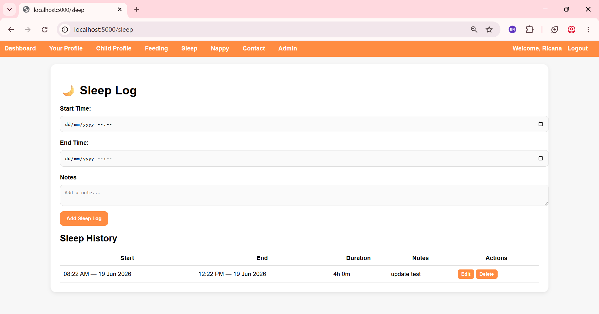
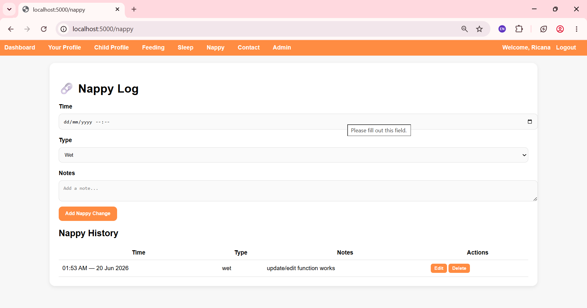

© 2026 ricanapx. Licensed under CC BY-NC 4.0. Not for commercial use.

👶🍼Childcare Tracking App
A full‑stack Flask application using SQLite for user accounts and MongoDB for childcare logs.
This app tracks feeding, sleep, and nappy events with clean forms, daily summaries, editing, deleting, validation, and a modern UI.

📘 Project Description
This Childcare Tracking App is a full‑stack Flask application designed for parents who want a simple, reliable way to track their child’s daily routines. The app provides clean, easy‑to‑use forms for logging feeding, sleep, and nappy events, along with a dashboard that summarises daily activity at a glance.

User accounts and child profiles are stored in SQLite, while childcare logs are stored in MongoDB for flexibility and scalability. The app includes validation, editing, deleting, and a modern UI built with custom CSS.

This project demonstrates full‑stack development skills, database design, CRUD operations, authentication, and clean UI/UX principles

⭐ Features

👶 Child Profile
Add and view full child details
Automatically calculates age and development stage

Includes:
Child name
Date of birth
Age (automatically calculated)
Development stage (Newborn, Infant, Toddler, Preschooler, etc.)
Gender

The development stage updates automatically based on the child’s age.

👩 Parent Profile
View and manage parent account details
Centralised parent information used across the app

Includes:
First & last name
Username
Email
Parent gender
Parent date of birth
Account creation date

🍽️ Feeding Log
Track milk, water, juice, meals, and snacks
Smart input:
Drinks → amount + unit
Meals/snacks → percentage eaten
Add notes
Edit and delete entries

😴 Sleep Log
Log sleep start and end times
Automatic duration calculation
Edit and delete entries

🧷 Nappy Log
Track wet/dirty nappies
Add optional notes
Edit and delete entries

📊 Dashboard
Daily summaries
Quick overview of feeding, sleep, and nappy activity
Clean, simple UI

🔐 Authentication
Register
Login
Logout
Session‑based user access

🗄️ MongoDB Database
All logs stored in MongoDB
Uses ObjectId for editing/deleting

🗄️ SQLite Database (Users & Children)

👨‍👩‍👧 Users Table
Stores parent account information.

| Column | Type | Description |
| --- | --- | --- |
| id | INTEGER PK | Unique user ID |
| first_name | TEXT | Parent’s first name |
| last_name | TEXT | Parent’s last name |
| email | TEXT UNIQUE | Login email |
| username | TEXT UNIQUE | Chosen username (used across the app) |
| password | TEXT | Hashed password (Werkzeug) |
| parent_gender | TEXT | Parent’s gender |
| parent_dob | TEXT | Parent’s date of birth |
| created_at | TEXT | Timestamp when the account was created |

👶 Children Table
Stores child profile information linked to the parent.

| Column | Type | Description |
| --- | --- | --- |
| id | INTEGER PK | Unique child ID |
| user_id | INTEGER FK | Links child to parent |
| child_name | TEXT | Child’s name |
| dob | TEXT | Child’s date of birth |
| gender | TEXT | Child’s gender |

🛠️ Tech Stack

🔧 Backend
Python
Flask
Jinja2 templating
PyMongo
MongoDB
SQLite

🎨 Frontend
HTML
CSS (custom styling)

🧰 Tools
Git & GitHub
Windows CMD / PowerShell / Git Bash

📸 Screenshots

Dashboard

Parent Profile

Child Profile

Feeding Log

Sleep Log

Nappy Log

🚀 Installation & Setup
Follow these steps to run the project locally:
1. Clone the repository
git clone <your-repo-url>
cd <your-project-folder>

2. Create a virtual environment
python -m venv venv
venv\Scripts\activate   # Windows

3. Install dependencies
pip install -r requirements.txt

4. Set up SQLite (automatic)
SQLite is created automatically when you run the app.

5. Set up MongoDB
You can use either:

Local MongoDB
or
MongoDB Atlas (cloud)

Create a .env file in the project root:
MONGO_URI=your_mongo_connection_string
SECRET_KEY=your_secret_key

6. Run the app
python app.py

Open your browser at: http://127.0.0.1:5000

📘 How to Use the App
1. Register a new account
2. Log in to access your dashboard
3. Create your parent profile
4. Add your child’s profile
5. Use the dashboard to navigate between:
 Feeding log
 Sleep log
 Nappy log

6. Add new entries using the clean forms
7. View history tables for each log
8. Edit or delete entries as needed
9. Log out when finished

Project Structure
/static
    style.css

/templates
    base.html
    dashboard.html
    feeding.html
    sleep.html
    nappy.html
    login.html
    register.html
    child_profile.html
    parent_profile.html

app.py
requirements.txt
README.md
.env (not included in repo)

🔮 Future Improvements
- Charts for feeding, sleep and nappy trends
- Reminders and notifications
- Role-based access (eg, both parents logging)
- Multi-child support
- Mobile-friendly responsive layout
These improvements will make the app more powerful and user‑friendly over time.

👩‍💻 Author
Ricana P
Aspiring junior developer building full‑stack applications with Flask, MongoDB, and SQLite.
Focused on clean UI, practical features, and real‑world problem solving.

GitHub: https://github.com/ricanapx
LinkedIn: https://www.linkedin.com/in/ricana-p-62a0b1224 
